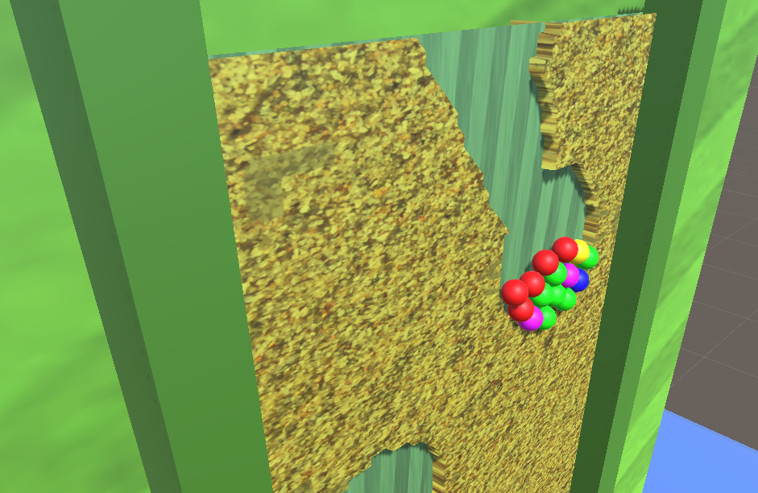

# Sand Balls game
This is the prototype game implementation of the sand balls game by say games

---

# Gameplay

# How to implement
Head to this medium [blog](https://medium.com/@hemanthvanam/implement-sand-balls-mechanics-5557effd3195) to find out how to implement this mechanics

# Play the game 
Head to my Unity connect account to play the game. ([link](https://connect.unity.com/mg/other/sand-balls-physics-implementation))

## Contact Info
If you like my work or have any improvement idea on this project don't mind to connect with me in twitter [@Not_Hemanth](https://twitter.com/Not_Hemanth) or unityConnect [@hemanthvanam](https://connect.unity.com/u/hemanth-vanam)

## Screenshots

